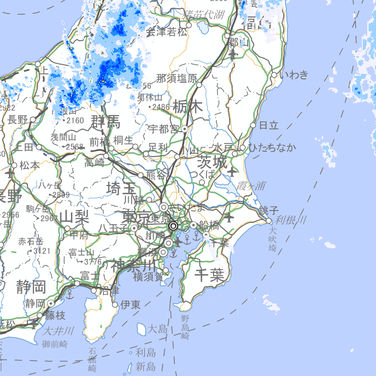
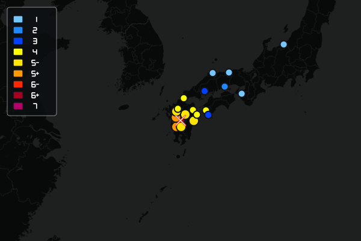
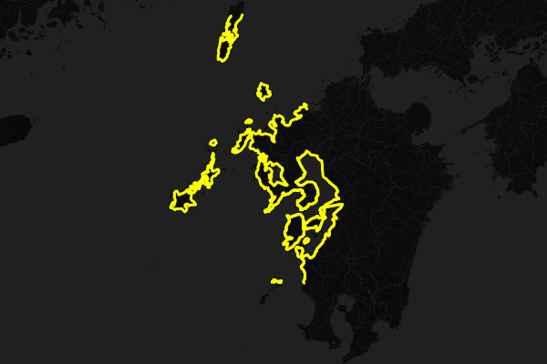

# Shindo Discord Bot

**地震・津波の速報から、地域の気象警報と雨雲まで。Discordで確認できる防災・天気Botです。**

気象庁・P2P地震情報をもとに、指定チャンネルへ地震・津波や市区町村別の気象警報を通知します。地域を選んで雨雲レーダーを表示したり、今後3時間の降水予報を通知したりできます。

[画像で見る](#demo) · [最初の設定](#quickstart) · [コマンド一覧](#commands) · [Railwayで動かす](#railway) · [開発・検証](#development)

| できること | 内容 |
| --- | --- |
| 地震・津波を知らせる | 緊急地震速報、地震情報、津波情報。地震は最低震度を指定可能 |
| 地域の警報を知らせる | 大雨・土砂災害・高潮・暴風などの警報、河川氾濫情報。注意報も選択可能 |
| 雨雲を画像で見る | 気象庁の雨雲画像と地理院地図を合成。動画・凡例へのリンク付き |
| 雨の予報を知らせる | 今後3時間の時間別降水予報を、指定した降水量で通知 |
| Discordだけで設定する | 地域の候補選択、通知先の指定、設定確認、地域ごとの通知停止 |

<a id="demo"></a>

## 画像で見る

以下は**Botの出力画像・既存サンプル**です。Discordアプリのスクリーンショットではありません。保存済みの画像であり、現在の地震・津波・雨雲の状況を示すものではありません。

### 雨雲レーダー

`/weather radar` で市区町村を選ぶと、周辺の雨雲画像を表示します。白丸は地域の中央付近です。Discord上では、メッセージのタイトルから気象庁の動画・凡例を開けます。

<p align="center">
  
</p>

*2026年9月22日の公開API接続検証で、実際のBotの画像生成処理から保存した画像です。雨雲：気象庁／背景：地理院タイル。*

### 地震・津波マップ

<table>
  <tr>
    <th>震度分布のサンプル</th>
    <th>津波注意報のサンプル</th>
  </tr>
  <tr>
    <td></td>
    <td></td>
  </tr>
  <tr>
    <td>観測点を震度別の色で表示します。</td>
    <td>対象の沿岸を線で強調します。</td>
  </tr>
</table>

既存の `sample-output/` に保存されていたサンプルです。現在の通知内容・配信状態を表すものではありません。画像の元ファイルと更新方法は [画像について](docs/images/README.md) を参照してください。

<a id="quickstart"></a>

## 最初の設定

Botがサーバーに参加・起動している場合は、次の3ステップで通知を始められます。まだ起動していない場合は [Railwayで動かす](#railway) を参照してください。

### 1. 地震・津波の通知先を選ぶ

```text
/set_eq_channel channel:#地震速報
```

通知設定を変更するメンバーには、**「サーバー管理」権限**が必要です。地震の通知を絞りたい場合は `/set_eq_threshold` で最低震度を選びます。津波情報と緊急地震速報の取消は、この震度フィルターの対象外です。

### 2. 天気を知りたい地域を選ぶ

```text
/weather set area:東京都 千代田区 channel:#天気
```

`area` に市区町村名を入力し、**表示される候補から選択**してください。同名の市町村は都道府県名を確認します。上のコマンドは入力例です。チャンネル名も実際のサーバーの候補から選択します。

既定では、気象警報と1時間あたり **1 mm以上**の降水予報を通知します。注意報はOFFです。初回確認は通常約1分以内で、発表中の対象警報や条件に合う降水予報がなければ通知は届きません。

### 3. 設定と雨雲を確認する

```text
/weather status
/weather radar area:東京都 千代田区
```

`status` で登録地域・通知先・監視状態を確認できます。使い方に迷ったら `/help` を開いてください。

**設定はサーバー単位で共有され、最大10地域を登録できます。** 気象コマンドの返答は実行した本人だけに表示され、自動通知は指定チャンネルに届きます。地域中央付近の座標を使うため、広い市町村・離島などでは実際の所在地と差が生じます。

<a id="commands"></a>

## コマンド一覧

### 情報を見る

| コマンド | 用途 |
| --- | --- |
| `/help` | 設定方法と使い方を表示 |
| `/get_eq` | 直近の地震情報を確認 |
| `/weather now area:地域` | 発表中の気象警報・注意報と河川氾濫情報を確認 |
| `/weather radar area:地域` | 雨雲レーダー画像を表示 |
| `/weather status` | 登録地域・通知先・最終成功時刻・エラーを確認 |
| `/ping` | Discordへの接続状況を確認 |

`now`・`radar` は通知登録していない地域でも利用できます。

### 通知を設定する（サーバー管理権限が必要）

| コマンド | 用途 |
| --- | --- |
| `/set_eq_channel channel:チャンネル` | 地震・津波の通知先を設定 |
| `/set_eq_threshold threshold:最低震度` | 地震の最低震度を設定 |
| `/weather set area:地域 channel:チャンネル` | 地域別の通知を登録・変更 |
| `/weather remove area:地域` | 指定地域の気象・降水通知を停止 |

### 気象通知の調整

`/weather set` には次のオプションがあります。

| オプション | 既定値 | 内容 |
| --- | --- | --- |
| `warnings` | `true` | 気象警報・河川氾濫情報を通知 |
| `advisories` | `false` | 注意報も含める。`warnings:true` の場合に有効 |
| `rain` | `true` | 今後3時間の降水予報を通知 |
| `threshold` | `1` | 通知する1時間降水量の基準。0.1～100 mm |

例えば、注意報を含めて通知し、降水予報は停止する場合：

```text
/weather set area:東京都 千代田区 channel:#天気 warnings:true advisories:true rain:false
```

**再設定時、省略したオプションは既定値に戻ります。** 地域の通知を完全に停止する場合は `/weather remove` を使ってください。

<a id="railway"></a>

## Railwayで動かす

### 1. Botと環境変数を用意する

DiscordのBotを作成し、Botとスラッシュコマンドを使える状態でサーバーに追加します。通知先にはBotの次の権限が必要です。

- チャンネルを見る
- メッセージを送信
- 埋め込みリンク
- ファイルを添付（地震の画像・雨雲レーダー）

RailwayのVariablesに以下を設定します。[`.env.example`](.env.example) も参照してください。

| 変数 | 必須 | 値 |
| --- | --- | --- |
| `TOKEN` | 必須 | Discord Bot Token |
| `CLIENT_ID` | 必須 | Discord Application ID |
| `GUILD_ID` | 任意 | コマンドを登録するサーバーID |
| `GUILD_IDS` | 任意 | 複数サーバーIDをカンマで区切って指定 |
| `DATA_DIR` | Railwayでは設定推奨 | `/data`（次のVolume設定と合わせる） |

トークンをGitに保存しないでください。`GUILD_ID`・`GUILD_IDS` はコマンド登録先の指定であり、通知先はDiscordのコマンドで設定します。

### 2. 設定を保存するVolumeを追加する

**RailwayのVolumeを `/data` にマウントし、`DATA_DIR=/data` を設定してください。レプリカは1台で運用します。**

Volumeがないと再デプロイで通知設定が失われます。JSONファイル保存のため、複数プロセスから同じ保存先への書き込みには対応していません。

### 3. デプロイして初期設定する

このリポジトリの [Dockerfile](Dockerfile) と [railway.json](railway.json) を使います。

```text
npm ci → TypeScriptビルド → 開発用依存関係を削除
        → スラッシュコマンド登録 → Bot起動
```

起動時はグローバル登録に加え、指定サーバーにもコマンドを登録します。サーバー未指定時は参加中のサーバーへ登録します。起動後にDiscordで `/help` を実行し、[最初の設定](#quickstart) に進んでください。登録・起動エラーはRailwayのログで確認します。

<details>
<summary>保存ファイルと旧版からの移行</summary>

保存先には以下のファイルが作成されます。

| ファイル | 内容 |
| --- | --- |
| `eq_channels.json` | 地震・津波の通知先 |
| `eq_thresholds.json` | 地震の最低震度 |
| `latest_eq_ids.json` | 地震・津波の取得済み情報 |
| `eq-deliveries.json` | 地震・津波の宛先別送信状態 |
| `weather.json` | 地域別の通知設定 |
| `weather-state.json` | 気象・降水の監視・送信状態 |

旧版はプロジェクトの1階層上の `data`（Dockerでは `/data`）に保存していました。既存の設定がある場合は、ファイルをバックアップし、新しいVolumeへ移してから起動してください。

旧版の全国一括洪水通知は、`/weather set` による地域別の警報・河川氾濫通知に置き換えています。移行後に対象地域を登録してください。

</details>

## 通知のタイミングとデータ

| 情報 | 配信元・確認間隔 | 通知するタイミング |
| --- | --- | --- |
| 緊急地震速報 | P2P地震情報／WebSocket | 受信時。地図生成を待たずに通知 |
| 地震情報 | P2P地震情報＋気象庁／気象庁は処理完了後約60秒間隔 | 新しい情報を取得したとき |
| 津波情報 | 気象庁／処理完了後約60秒間隔 | 新しい情報を取得したとき |
| 気象警報・河川氾濫情報 | 気象庁／約1分ごと | 対象の種類が変わったとき・解除時 |
| 降水予報 | Open-Meteo／約15分ごと | 今後3時間に基準以上となる最初の時間枠。再通知は3時間以上間隔 |
| 雨雲レーダー | 気象庁＋地理院タイル | `/weather radar` を実行したとき |

**降水通知は予報です。観測による降り始めの検知ではありません。** 雨・雪を含む1時間降水量を扱い、表示時刻は「その時刻までの1時間」を意味します。

<details>
<summary>対応範囲・再通知・通信エラー時の動作</summary>

- 気象警報は2026年更新後の `warning/data/r8`、河川氾濫情報は `flood/data/r8/flood_xml.json` を使用します。大雨・土砂災害・高潮・暴風・暴風雪・大雪・波浪と各種注意報に対応しています。
- 警報の初回確認は、発表中の対象警報がある場合だけ通知します。同じ警報の継続や本文だけの変更では再通知しません。河川氾濫情報は配信元の対象市区町村で絞り込み、配信対象にない河川は扱いません。
- 地震は複数の情報源から同じ地震の情報が届く場合があります。
- 降水予報は同じ時間枠を重複通知せず、再通知は3時間以上空けます。
- 気象の取得・送信失敗は次の巡回で再試行します。失敗を「警報なし」「雨なし」として扱いません。
- 雨雲画像が30分より古い場合やタイル取得に失敗した場合は、画像の代わりに気象庁のレーダーへのリンクを案内します。
- 通知状態は保存され、再起動後も重複抑止を維持します。ただしDiscord送信直後・保存直前に停止すると、重複する可能性があります。

</details>

## 困ったとき

| 症状 | 確認すること |
| --- | --- |
| スラッシュコマンドが表示されない | 起動時のコマンド登録ログと `CLIENT_ID`・`GUILD_ID` を確認。グローバル登録は反映に時間がかかる場合があります |
| 設定を変更できない | 実行メンバーに「サーバー管理」権限があるか確認 |
| 地域の候補が出ない | 市区町村名の一部で検索。起動直後や通信障害時は少し待って再実行 |
| 気象通知が届かない | `/weather status` で登録・ON/OFF・エラーを確認。対象の警報や降水予報がない間は通知されません |
| チャンネルへの送信に失敗する | Botの閲覧・送信・埋め込みリンク権限と、チャンネル側の権限設定を確認 |
| 雨雲画像が表示されない | ファイル添付権限を確認。取得失敗時は表示された気象庁のリンクを利用 |
| 再デプロイで設定が消える | Volumeのマウント先と `DATA_DIR` がともに `/data` か確認 |

<a id="development"></a>

## ローカル開発・検証

**Node.js 22.12以上**を使用します。RailwayのDockerfileはNode.js 22系です。

```sh
npm ci
```

[`.env.example`](.env.example) を `.env` にコピーし、トークンなどを設定します。`DATA_DIR` 未設定時の保存先はプロジェクト内の `data/` です。

```sh
npm test                  # ビルド＋オフライン回帰テスト（Discordには接続しない）
npm run lint              # 静的検査
npm run deploy-commands   # Discordにコマンドを登録
npm start                 # Botを起動
```

公開APIへの読み取り接続と、実際の雨雲画像生成を確認する場合：

```sh
npm run compile
node scripts/smoke.cjs
npm audit
```

画像は `sample-output/weather-radar.png` に保存されます。この接続テストはDiscordへ通知しません。テストの実装は [tests/weather.test.cjs](tests/weather.test.cjs)、接続確認は [scripts/smoke.cjs](scripts/smoke.cjs) を参照してください。

<details>
<summary>2026年9月22日の実装検証記録</summary>

- TypeScriptビルド・ESLint成功。28件の自動テストがNode.js 22・24で成功。
- 警報の発表・継続・解除・危険警報への切替、地域外除外、河川氾濫、欠損データ、重複通知、再試行、監視中の削除、再設定、権限不足を検証。
- 地震通知の宛先別再試行、並行保存、緊急地震速報取消時の震度フィルター除外、地図タイルの画像合成を検証。
- 気象庁の1,805地域・現行警報・雨雲画像とOpen-Meteo予報を取得し、雨雲画像を目視確認。
- `npm audit` は検証時点で0件。現在の結果は手元で再実行してください。
- この検証ではDiscord実送信・Railway本番デプロイを実施していません。本番の送信権限・Volume永続性は別途確認が必要です。

</details>

## データ提供元

- [気象庁](https://www.jma.go.jp/)：地震・津波・気象警報・河川氾濫情報・雨雲
- [P2P地震情報](https://www.p2pquake.net/)：地震情報・緊急地震速報の配信
- [Open-Meteo](https://open-meteo.com/en/docs)：時間別降水予報
- [地理院タイル](https://maps.gsi.go.jp/development/ichiran.html)：雨雲レーダーの背景地図
- [CARTO](https://carto.com/attributions)／[OpenStreetMap contributors](https://www.openstreetmap.org/copyright)：地震・津波マップの背景地図

Open-Meteoの無料APIは非商用利用向けです。商用・大規模運用では提供元の利用条件と上限を確認してください。通知は配信元・回線・Discordの状態に依存するため、自治体や気象庁の最新情報も確認してください。
